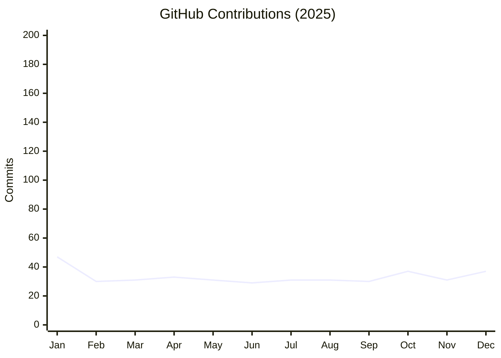

***

***

***

<!-- CONTRIBUTIONS_CHART_START -->

```mermaid
xychart-beta
    title "GitHub Contributions (2025)"
    x-axis ["Jan","Feb","Mar","Apr","May","Jun","Jul","Aug","Sep","Oct","Nov","Dec"]
    y-axis "Commits" 0 --> 200
    line [47, 30, 31, 33, 31, 29, 31, 31, 30, 37, 31, 37]
```
<!-- CONTRIBUTIONS_CHART_END -->
