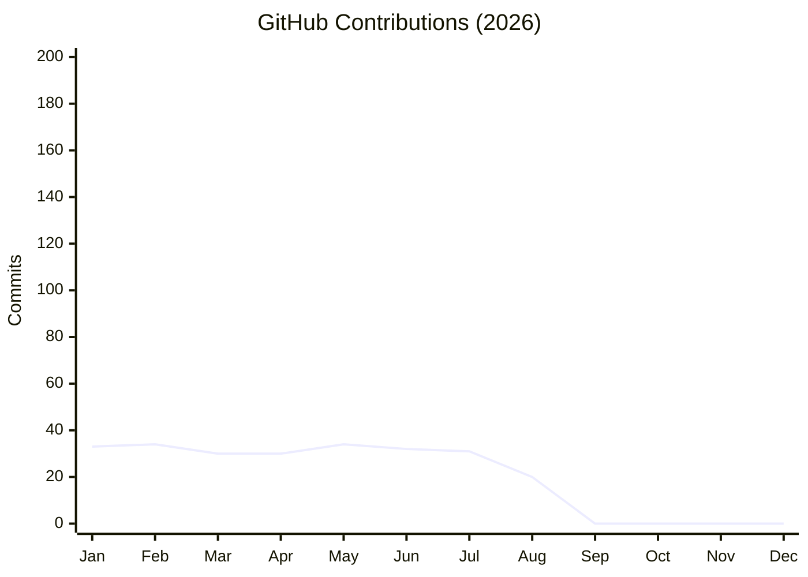

<!-- CONTRIBUTIONS_CHART_START -->

```mermaid
xychart-beta
    title "GitHub Contributions (2026)"
    x-axis ["Jan","Feb","Mar","Apr","May","Jun","Jul","Aug","Sep","Oct","Nov","Dec"]
    y-axis "Commits" 0 --> 200
    line [33, 34, 30, 30, 34, 32, 31, 20, 0, 0, 0, 0]
```
<!-- CONTRIBUTIONS_CHART_END -->